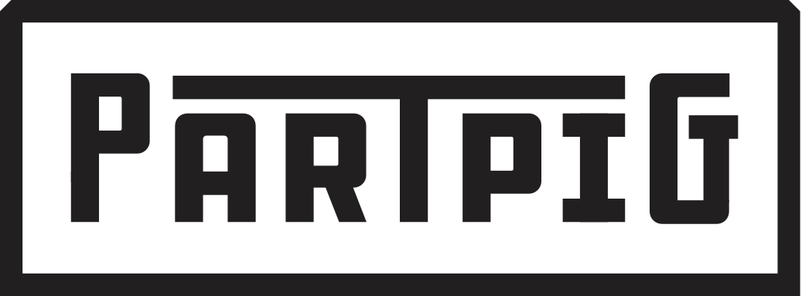

## PartPig
PartPig is an e-commerce platform built to facilitate the trading of used car parts.

## Motivation
PartPig exists to fill the gap in connecting the buyer and the seller in a way that is user friendly and convenient.

## Usage
PartPig is still in beta. Because of that we focused most of the parts for sale under: 
- Make: Subaru
- Model: Impreza WRX STI
- Year: 2007

Please search these categories for a better experience.

## Project
view this project [live](https://partpig.bylizhang.com)

## Features
- [x] Image upload and hosting with AWS
- [x] Email integration with SendGrid
- [x] Seamlessly list a part!
- [x] User Dashboard with editable listings.

## Technologies used
- [React](https://reactjs.org/)
- [PHP](http://www.php.net/)
- [AWS](https://aws.amazon.com/)
- [MySQL](https://www.mysql.com/)
- [Confluence/Jira](https://www.atlassian.com/software)

## Contributors
[caxpper](https://github.com/caxpper) |
[Briantmorr](https://github.com/Briantmorr) |
[Eeps30](https://github.com/Eeps30) |
[daveforman](https://github.com/daveforman) |
[ByLiZhang](https://github.com/ByLiZhang) 

## License
This project is licensed under the MIT License © [Li Zhang](https://bylizhang.com)

